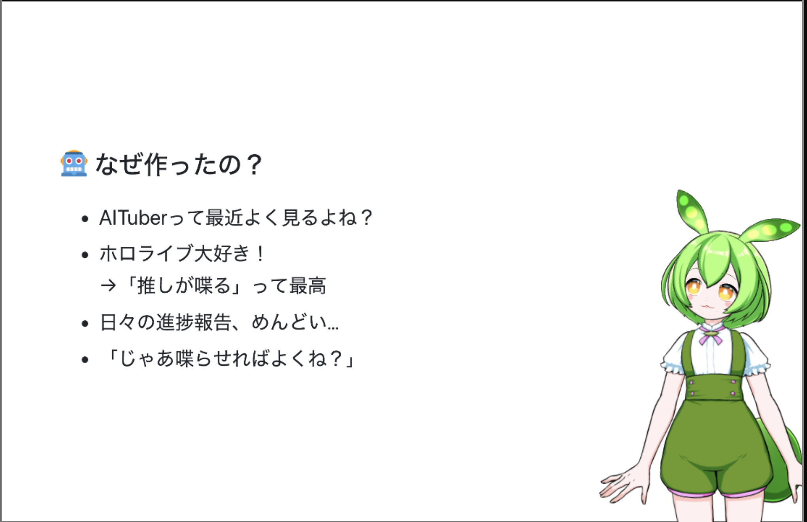

# 供養 
Live2D x voicevox x AI でいい感じにスライド発表やってもらえないかなって思ってやってみた、
でもいい感じにならなくてやめた。

# 内容
1. (marpを使ってスライド作成 => PDF書き出し) 
2. serverにアップロード
    1. PDFスライドごとに画像生成・文字起こし
    2. スライドごとに原稿など作成
3. web-appで再生
    1. voicevoxを使って音声生成
    2. live2dを使ってアニメーション作成・lipsync

# Getting Started
1. compose.yamlにあるようなvoicevoxを動かす
2. live2d model (e.g. [ずんだもん](https://booth.pm/ja/items/5363599) )をダウンロードして`data/source/`配下に置く。（frontendでmodelPathみたいなハードコーディングしている変数を帰る必要あるかも〜）
3. frontendにて「npm run dev」、backendにて「pip install -r requirements.txtとpython main.py」を実行
    - `backend/.env.template`を参考に`backend/.env`を作る必要ある
    - `backend/lib/`配下に適切なライブラリを配置する必要がある（現在ディレクトリのみ残している）
4. http://localhost:3000やhttp://localhost:8000などをブラウザを開く
5. Webブラウザの下の方でスライドをアップロードする
